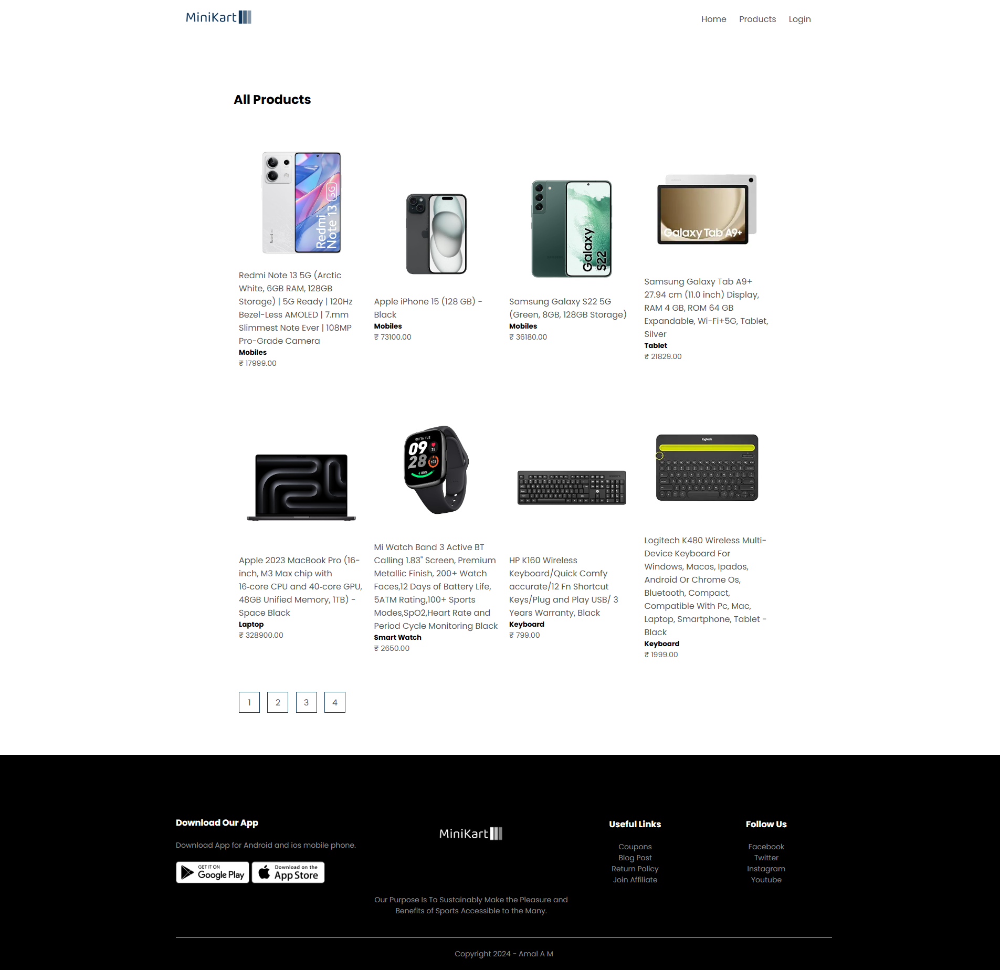
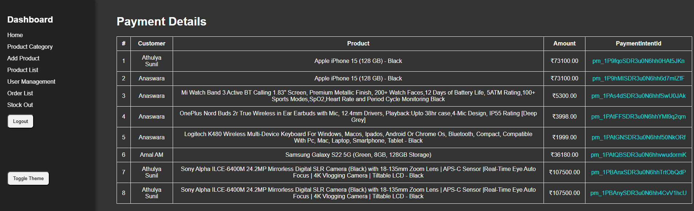
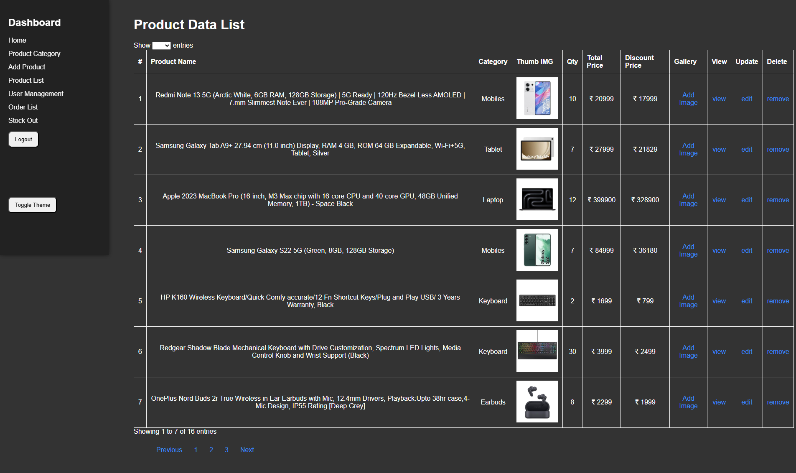

# 🛒 MiniKart

MiniKart is a lightweight ecommerce web application built with modern Node.js technologies. It includes essential features like customer registration, product purchase with Stripe payment integration (test mode), and admin product management via a secure dashboard.

---

## 🚀 Technologies Used

- **Backend**: Node.js, Express.js  
- **Database**: PostgreSQL with Prisma ORM  
- **Authentication**: JSON Web Token (JWT)  
- **Email Notifications**: Nodemailer  
- **UI Components**: DataTables  
- **File Upload**: Multer  
- **Payment Integration**: Stripe (Test Mode)

---

## 📸 Project Screenshot





> 📎 *Make sure to place your screenshot in a `screenshots/` folder inside the project directory.*

---

## 🧰 Features

### 🌐 Landing Page
- Clean and responsive design for user-friendly navigation.
- Product listings preview for visitors.

### 👨‍💼 Admin Dashboard
- Add new products with image, name, price, and description.
- View all product listings, customer data, and payment records.
- Monitor successful Stripe transactions.

### 👥 Customer Panel
- Customer registration & login using JWT.
- Personalized dashboard showing order history and payment status.

### 💸 Stripe Payment (Test Mode)
- Secure checkout using Stripe in test mode.
- Saves product, customer, and payment details in the database.

### 📧 Email Notifications
- Sends email confirmation upon successful registration or purchase using Nodemailer.

---

## 📦 Installation & Setup

```bash
# Clone the repository
git clone https://github.com/yourusername/minikart.git
cd minikart

# Install dependencies
npm install

# Setup environment variables
cp .env.example .env
# Update the .env file with your credentials

# Run database migrations
npx prisma migrate dev

# Start the server
npm start
